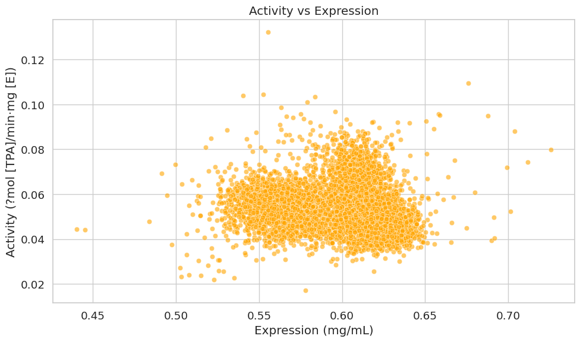

# Predictive-PET-Zero-Shot-Test-Data-2025

**Team Name:** PersiZyme  
**Organized by:** The Align Foundation  
**Tournament:** [2025 PETase Tournament](https://alignbio.org/get-involved/competitions/2025-petase-tournament)

**Team Leader:** Fereshteh Noroozi Tiyoula  
**Team Members:**
- Kaveh Kavousi
- Shohreh Ariaeenejad
- Ali Etemadi
- Donya Afshar Jahanshahi

## Objective
Fully computational **zero-shot** prediction of enzymatic properties for PETase variants in the Predictive Phase of the 2025 Protein Engineering Tournament.  
We predicted:
- Expression levels (mg/mL)
- Specific activity (?mol TPA/min·mg [E])
- Turnover number (kcat in s⁻¹)

**Strict zero-shot compliance:** No use of any experimental data from the tournament dataset for training, calibration, or fine-tuning.

## Methodology Overview

### 1. Molecular Weight (MW) Calculation
- Computed directly from primary sequence using **BioPython**.
- Formula: Sum of residue masses minus (n-1) × 18.015 Da (water loss in peptide bonds).
- Outputs: Protein ID, sequence length, MW (Da).

### 2. kcat Prediction
- Used the zero-shot ML model from:  
  **Kroll et al. (2023)** – "Turnover number predictions for kinetically uncharacterized enzymes using machine and deep learning"  
  [Nature Communications, DOI: 10.1038/s41467-023-39840-4](https://doi.org/10.1038/s41467-023-39840-4)
- Predictions based solely on sequence features — no fine-tuning on tournament data.

### 3. Specific Activity Conversion
- Formula:  
  Activity = (kcat [s⁻¹] × 60) / (MW [g/mol])   → ?mol TPA / min / mg enzyme
- Implemented in Python with **pandas** in Google Colab.

### 4. Solubility Prediction
- Tool: **NetSolP** web server  
- Probability scores (0–1) for soluble expression in *E. coli*.  
- Wild-type-like variants: ~0.65–0.78 (moderate to high solubility).

## Workflow
1. FASTA sequence input  
2. MW calculation (BioPython)  
3. kcat prediction (Kroll et al. model)  
4. Activity conversion  
5. Solubility scoring (NetSolP)  
6. Final CSV export for submission

All steps run in **Google Colab** — fully reproducible, no data leakage.

## Results Highlights
Key distributions and correlations from our predictions:

- **Expression**: Unimodal ~0.60 mg/mL (shoulder ~0.55–0.57), consistent with NetSolP solubility.  
- **Specific Activity**: Peak ~0.055–0.060 ?mol TPA/min·mg [E], long right tail (>0.10).  
- **kcat**: Tight cluster ~20–30 s⁻¹ (peak ~25 s⁻¹), Gaussian-like.  
- **MW**: Sharp in 26–28 kDa range (three subpopulations).  

**Correlations** (from heatmap):
- kcat ↔ Activity: r ≈ 0.99 (expected, direct derivation)  
- MW ↔ Expression: r = 0.54 (longer/stable folds express better?)  
- MW ↔ kcat/Activity: weak negative (r ≈ -0.18 to -0.28)  
- Expression ↔ Activity/kcat: near-zero (independent traits — desirable!)

### Key Visualization: Activity vs Expression
Many variants show high activity (>0.08) across broad expression ranges (0.55–0.65 mg/mL), highlighting balanced candidates.

<!-- اگر عکس رو با نام دیگه‌ای آپلود کردی، لینک یا نام فایل رو اینجا تغییر بده. مثلاً:  
 -->

(برای نمایش بهتر عکس: فایل PNG/JPG رو در repo آپلود کن، ترجیحاً در فولدر `figures/` یا مستقیم در root. GitHub خودش رندر می‌کنه.)

## Scientific Rigor & Reproducibility
- Dimensional consistency in all calculations  
- Derived from standard enzyme kinetics  
- No tournament data leakage  
- Pipeline fully reproducible via provided scripts

## Code Structure
- `mw_calculation.py` → Molecular weight from FASTA  
- `kcat_prediction.ipynb` → Integration with Kroll model (or wrapper)  
- `activity_conversion.py` → kcat to specific activity  
- `netsolp_integration.py` → Solubility scoring (if scripted)  
- `requirements.txt` → Dependencies (pandas, biopython, etc.)  
- `figures/` → Plots (including activity_vs_expression.png)

## Citation & Acknowledgments
If you find this work useful, please cite:
- Kroll et al. (2023), Nature Communications  
- This repo: https://github.com/[your-username]/PersiZyme-PETase-2025

Questions? Contact team lead or tournament@alignbio.org.

We look forward to experimental validation and potential Generative Phase!

**Committed to open, reproducible protein engineering for sustainable plastic degradation.**
